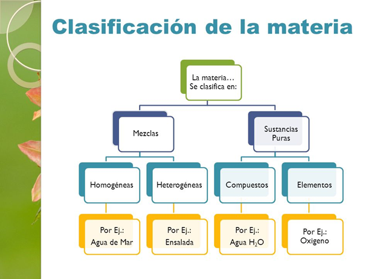
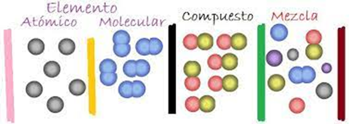

# Clasificación de la materia

Una muestra de materia puede ser un gas, un líquido o un sólido. Estas tres formas de materia se conocen como estados de la materia.
La mayoría de las formas de la materia que encontramos, por ejemplo, el aire que respiramos (un gas), la gasolina para los automóviles (un líquido) y la acera en la que caminamos (un sólido), no son químicamente puras. Sin embargo, podemos descomponer o separar estas formas de la materia en diferentes sustancias puras.
Una sustancia pura (generalmente conocida como sustancia) es materia que tiene propiedades definidas y una composición que no varía de una muestra a otra. El agua y la sal de mesa común (cloruro de sodio), que son los componentes principales del agua de mar, son ejemplos de sustancias puras.

Todas las sustancias son elementos o compuestos. Los elementos no pueden descomponerse en sustancias más simples. En el nivel molecular, cada elemento se compone de sólo un tipo de átomo. Los compuestos son sustancias que contienen dos o más elementos; contienen dos o más tipos de átomos. Por ejemplo, el agua es un compuesto constituido de dos elementos: hidrógeno y oxígeno. Una mezcla de sustancias que  son combinaciones de dos o más sustancias en las que cada sustancia mantiene su propia identidad química.
Elementos:

En la actualidad se conocen 117 elementos. Estos elementos varían ampliamente en su abundancia. Por ejemplo, tan sólo cinco elementos —oxígeno, silicio, aluminio, hierro y calcio— conforman más del 90% de la corteza terrestre (incluidos los océanos y la atmósfera). Asimismo, tan sólo tres elementos (oxígeno, carbono e hidrógeno) constituyen más del 90% de la masa del cuerpo humano.

Compuestos:

La mayoría de los elementos puede interactuar con otros para formar compuestos.
Por ejemplo, considere que cuando el hidrógeno gaseoso arde en oxígeno, estos dos elementos se combinan para formar el compuesto agua. De manera inversa, el agua puede descomponerse en sus elementos componentes al pasar una corriente eléctrica a través de ella. El agua pura, independientemente de su fuente, consiste en 11% de hidrógeno y 89% de oxígeno en masa. Esta composición macroscópica corresponde a la composición molecular, la cual consiste en dos átomos de hidrógeno combinados con un átomo de oxígeno, las propiedades del agua no se parecen a las propiedades de sus elementos componentes. El hidrógeno, el oxígeno y el agua son sustancias únicas como consecuencia de que sus respectivas moléculas son únicas.

Mezclas:

La mayor parte de la materia que conocemos consiste en mezclas de diferentes sustancias. Cada sustancia de una mezcla conserva su propia identidad química y sus propiedades. En contraste con una sustancia pura que tiene una composición fija, la composición de una mezcla puede variar. Por ejemplo, una taza de café endulzado puede contener poca o mucha azúcar. Las sustancias que conforman una mezcla (como el azúcar y el agua) se conocen como componentes de la mezcla.
Algunas mezclas no tienen la misma composición, propiedades y apariencia en todos sus puntos. Por ejemplo, la textura y apariencia de las rocas y la madera varían en cualquier muestra típica. Tales mezclas son heterogéneas. Aquellas mezclas que son uniformes en todos sus puntos son homogéneas. El aire es una mezcla homogénea de las sustancias gaseosas nitrógeno, oxígeno y pequeñas cantidades de otras sustancias. El nitrógeno en el aire tiene todas las propiedades del nitrógeno puro, ya que tanto la sustancia pura como la mezcla contienen las mismas moléculas de nitrógeno. La sal, el azúcar y muchas otras sustancias se disuelven en agua para formar mezclas homogéneas. Las mezclas homogéneas también se conocen como disoluciones. Aunque el término disolución nos trae a la mente la imagen de un líquido en un vaso o en un frasco, las disoluciones pueden ser sólidas, líquidas o gaseosas. 

En resumen:

 

Vista molecular

