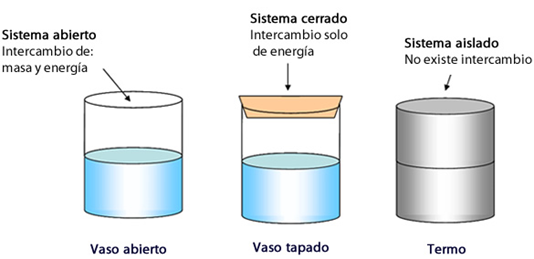
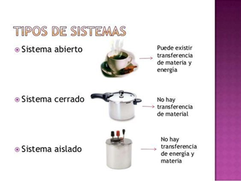
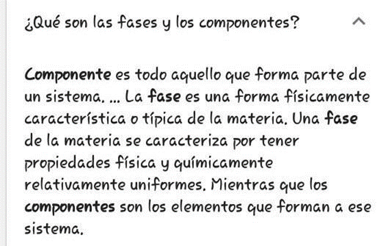
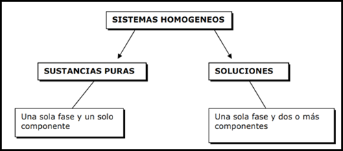
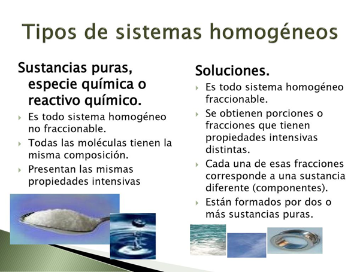

# Sistema Materiales

Para estudiar los sistemas materiales, podemos clasificarlos considerando distintos criterios, es decir, según donde centremos nuestra observación:

a. según los cambios de materia y energía con el medio ambiente;

b. según las propiedades intensivas de la materia.

a)	Clasificación de los sistemas materiales según su intercambio de materia o energía con el medio ambiente

Este criterio permite distinguir entre sistemas abiertos, cerrados y aislados.
Un sistema material es abierto cuando permite el intercambio de materia y energía con el medio ambiente. Por ejemplo, si colocamos agua fresca en un recipiente destapado, al cabo de un tiempo, el agua se va evaporando y pasa al medio que la rodea, es decir que se produce un intercambio de materia con el medio. Además varía su temperatura (adquiere la temperatura del ambiente) debido a que intercambia energía con el medio.
Un sistema material es cerrado cuando solamente puede intercambiar energía con el medio ambiente. Por ejemplo, si el recipiente con agua estuviera tapado, el agua no puede evaporarse al medio, ya que se lo impide la tapa (no intercambia materia). Pero sí adquiere la temperatura del ambiente (intercambia energía).
Un sistema material es aislado cuando no intercambia materia ni energía con el medio ambiente. Por ejemplo, si se coloca agua en un termo.

La realidad no siempre responde estrictamente a la definición. No existen paredes absolutamente aislantes, que  impidan totalmente el intercambio de energía con el medio.

Si  pensáramos en el hombre como un sistema, ¿qué tipo de sistema material sería, según la clasificación anterior?

b) Clasificación de los sistemas materiales según sus propiedades intensivas.

Sistemas homogéneos: Son aquellos que presentan las mismas propiedades intensivas en todos los puntos de su masa. Presentan continuidad en sus propiedades cuando se los observa a simple vista o con ayuda de instrumentos como el microscopio y el ultramicroscopio. No se puede diferenciar la separación de sus componentes, constituye una masa homogénea y cualquier porción que se tome tendrá la misma composición y propiedades. Son sistemas homogéneos una granalla de zinc, azufre, agua, glucosa, pero también lo son: agua azucarada, una solución de agua y sal, el acero (solución sólida de hierro y carbono), un anillo de oro (solución sólida de oro y cobre), el aire (solución gaseosa de nitrógeno, oxígeno y otros gases), etc. Posee una sola fase y uno o varios componentes.

Los sistemas materiales homogéneos se clasifican en disoluciones y sustancias puras según el número de sustancias que los formen.
Una disolución es un sistema homogéneo formado por la mezcla de dos o más componentes:

- disolvente: es el componente mayoritario de la disolución.

- soluto: es el componente minoritario.
  
El volumen final de una disolución es, en general, menor que la suma de los volúmenes del soluto y del disolvente, debido al reajuste de espacios entre las partículas.
Una sustancia pura es un sistema homogéneo formado por un solo componente.

Los sistemas homogéneos  son  un tipo de mezcla química conformada por dos o más componentes que no se pueden diferenciar al ser estudiados. Aun así, sus componentes pierden sus características y propiedades por el hecho de estar mezclados, ya que la unión no produce reacción química alguna.

Sistemas heterogéneos: Son aquellos que presentan distintas propiedades intensivas en por lo menos dos puntos de su masa.
Si analizamos un sistema constituido por agua y nafta comprobamos que no posee homogeneidad pues pueden distinguirse cada uno de los líquidos, en este sistema encontramos distintas porciones en donde las propiedades intensivas son constantes; se trata de las diferentes fases del sistema heterogéneo.

Fase es cada una de las partes homogéneas que constituye un sistema heterogéneo, está separada de las otras partes por límites físicos. El sistema material formado por agua y granallas de zinc, es un sistema heterogéneo, constituido por dos fases, una líquida el agua y la otra sólida el zinc en granallas.
 Posee dos o más fases y uno o varios componentes.

Ejemplos:

Mezcla de agua y hielo: Tiene dos fases: H2 O (liq.), H2 O(sólido), dos fases, Tiene solo un   componente: H2 O.

Mezcla de agua, hielo seco y vapor: Tres fases: Agua, CO2 y vapor, tres fases. Dos componentes: H2 O y CO2.
