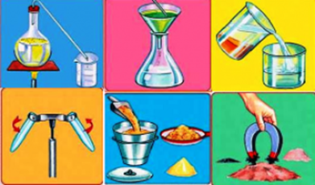

# Separación de mezclas

Debido a que cada componente de una mezcla mantiene sus propiedades, podemos separar una mezcla en sus componentes si aprovechamos las diferencias en sus propiedades. Por ejemplo, una mezcla heterogénea de limaduras de hierro y limaduras de oro podría separarse de manera individual mediante el color del hierro y del oro. Un método menos tedioso sería utilizar un imán para atraer las limaduras de hierro, y dejar las de oro. También podemos aprovechar una importante diferencia química entre estos dos metales: muchos ácidos disuelven el hierro, pero no el oro. Entonces, si colocamos nuestra mezcla en el ácido apropiado, éste disolvería al hierro pero no al oro. Después podríamos separarlos por filtración. Tendríamos que utilizar otras reacciones químicas, las cuales aprenderemos más adelante para transformar el hierro disuelto de nuevo en metal.

Un método importante para separar los componentes de una mezcla homogénea es la destilación, un proceso que depende de las diferentes capacidades de las sustancias de formar gases. Por ejemplo, si calentamos una disolución de sal y agua, el agua se evapora, formando un gas, y la sal permanece.

El vapor de agua puede convertirse de nuevo en líquido sobre las paredes de un condensador.
Las diferentes capacidades de las sustancias de adherirse a las superficies de varios sólidos, como el papel y el almidón, también pueden utilizarse para separar mezclas. Esta capacidad es la base de la cromatografía (literalmente "la escritura de los colores"), una técnica que puede producir resultados hermosos y sorprendentes. 

