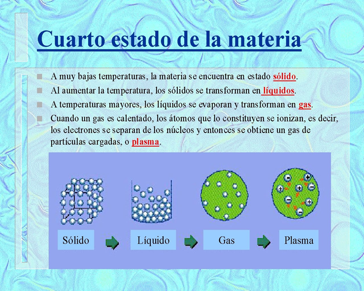
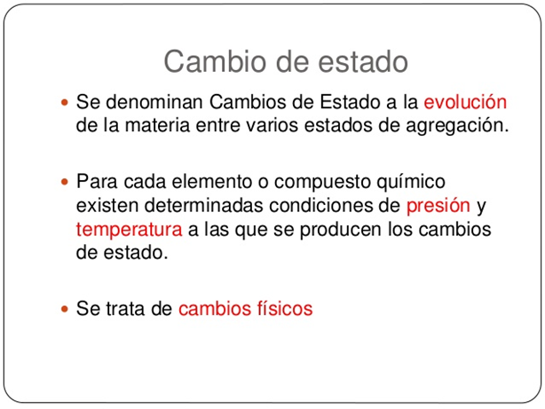

# Introducción:¿Qué es la Química?

En esta página exploraremos los "hermosos y científicos" caminos de la Química. Esa materia tan difícil para Muchos...
Cabe aclarar que esta página se realizo con el fin de comprender dicha rama de la ciencia, Acompañenme a leer y comprender de qué trata la Química.

Alguna vez se han preguntado por qué el hielo se derrite y el agua se evapora? ¿Por qué en otoño las hojas cambian de color?  y ¿cómo una batería genera electricidad?
¿Por qué los alimentos retardan su descomposición si los mantenemos fríos, y como es que nuestro cuerpo utiliza los alimentos para vivir?
La química responde a estas y a muchas otras preguntas similares. La química estudia los materiales y los cambios que experimentan. Uno de los atractivos de aprender química es ver como los principios químicos se aplican a todos los aspectos de nuestras vidas, desde las actividades cotidianas, como encender un fosforo, hasta las cuestiones de mayor trascendencia como el desarrollo de medicamentos para curar el cáncer, los principios químicos también aplican en las lejanías de nuestra galaxia, así como en nuestros alrededores.
La química estudia las propiedades y el comportamiento de la materia. La materia es el material físico del universo; es todo lo que tenga masa y ocupe espacio. Una propiedad es cualquier característica que nos permita reconocer un tipo particular de materia y distinguirla de otros tipos. Este libro, su cuerpo, las ropas que usa y el aire que respira son ejemplos de materia. No todas las formas de materia son tan comunes o tan familiares. Innumerables experimentos han demostrado que la enorme variedad de materia de nuestro mundo se debe a combinaciones de aproximadamente 100  sustancias muy básicas, o fundamentales, conocidas como elementos.
La química también proporciona los antecedentes para comprender las propiedades de la materia en términos de átomos, los bloques de construcción infinitesimales más pequeños de la materia. Cada elemento se compone de un solo tipo de átomo. Veremos que las propiedades de la materia se relacionan no solo con el tipo de átomos que contiene (su composición), sino también con el arreglo de estos átomos (su estructura).
Los átomos se pueden combinar para formar moléculas en las que dos o más átomos se unen en formas específicas.
Uno de los retos que los químicos a enfrentan es alterar la composición o estructura de las moléculas de forma controlada para crear nuevas sustancias con propiedades diferentes.
Todo cambio en el mundo observable, desde el agua en ebullición hasta los cambios que ocurren cuando nuestros cuerpos combaten los virus invasores, se basa en el mundo no observable de los átomos y las moléculas.
Así, conforme avancemos en nuestro estudio de la química, nos encontraremos pensando en dos mundos: el macroscópico de objetos de tamaño ordinario (macro = grande), y el submicroscópico de átomos y moléculas. Efectuamos nuestras observaciones en el mundo macroscópico (en el laboratorio, y en nuestro entorno cotidiano). Sin embargo, para comprender ese mundo, debemos visualizar el comportamiento de los átomos y moléculas en el nivel  las propiedades y el comportamiento de la materia mediante el estudio de las propiedades y el comportamiento de los átomos y moléculas.

## ¿Cómo se clasifica la materia?

La materia se clasifica por Dos formas principales de clasificar la materia son de acuerdo con su estado físico (como gas, líquido o sólido), y de acuerdo con su composición (como elemento, compuesto o mezcla).
Algunas preguntas:

a.La luz, la inteligencia y la belleza  ¿son materia?

b.El aire que está dentro de un globo ¿es materia?

c.¿Masa y peso serán lo mismo? Un astronauta pesa. 60 kilos en la Tierra. El mismo astronauta pesa en la Luna 10 kilos. ¿Por qué?

## Estados de la materia

Los estados de la materia son las formas en que la materia se presenta en función de sus propiedades físicas y estructurales. Tradicionalmente, se reconocen cuatro estados principales de la materia:

Sólido: En este estado, las partículas están muy cerca unas de otras y tienen una estructura ordenada. Tienen una forma y un volumen definidos.

Líquido: Las partículas en este estado están más separadas que en un sólido, lo que les permite fluir y tomar la forma del recipiente que los contiene. Tienen un volumen definido pero no una forma definida.

Gaseoso: En el estado gaseoso, las partículas están muy separadas y se mueven libremente. No tienen una forma ni un volumen definidos, y ocupan todo el espacio disponible.

Plasma: El plasma es un estado de la materia que ocurre a temperaturas muy altas, donde los átomos se ionizan, es decir, pierden o ganan electrones, creando iones positivos y electrones libres. El plasma es el estado más abundante en el universo observable, presente en estrellas, como el sol, y en algunos experimentos de laboratorio.

Además de estos cuatro estados principales, también se reconocen otros estados más exóticos en condiciones extremas, como el condensado de Bose-Einstein y el condensado fermiónico. Estos se forman a temperaturas extremadamente bajas y están más relacionados con la física cuántica.Pero nosotros nos vamos a concentrar en los principales del estudio de la química.

### Cambios de Estado

Como mencionamos anteriormente la Materia tiene Estados, por lo que existen cambios de Estados en la misma Materia. Por ejemplo el agua, se puede encontrar en estado sólido (hielo), líquido(agua) y en forma de gas(vapor de agua)(seguro a muchos le hicieron hacer vapor cuando estaban enfermos y con mucha congestión, wacala mucho moco).

